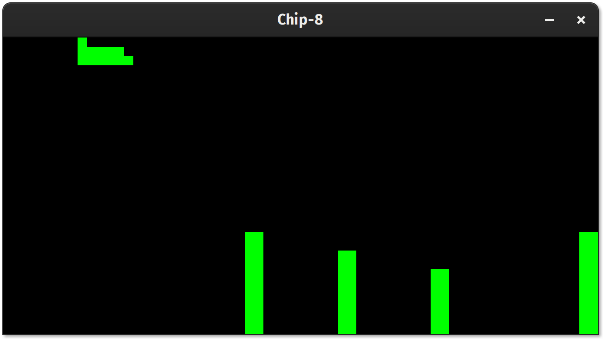
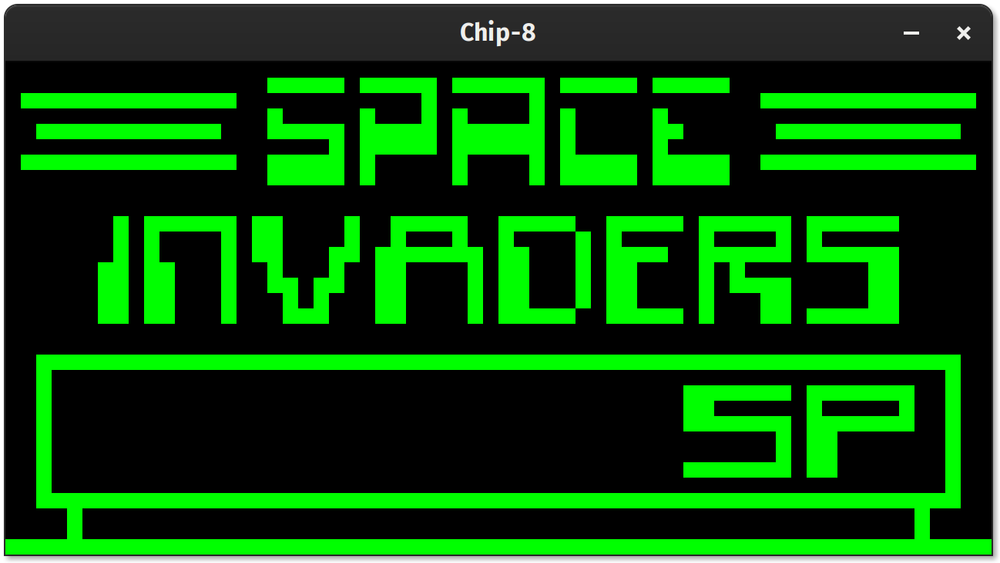
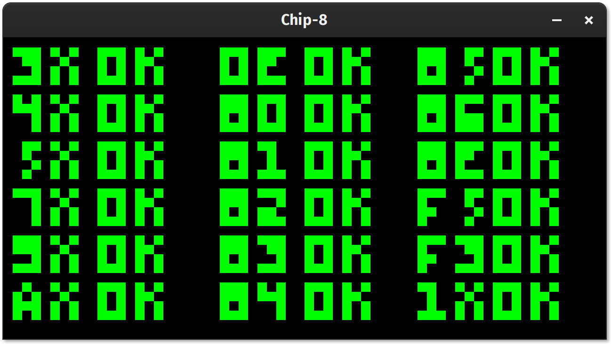

# chip8

Yet another Chip-8 emulator written in Rust.

```
RUST_LOG=info cargo run roms/BLITZ
```

Presss <kbd>Esc</kbd> to exit the emulator.

ROMs obtained from https://github.com/JamesGriffin/CHIP-8-Emulator and https://github.com/corax89/chip8-test-rom.


Keyboard
--------

Chip-8 Layout:

| `1` | `2` | `3` | `C` |
| `4` | `5` | `6` | `D` |
| `7` | `8` | `9` | `E` |
| `A` | `0` | `B` | `F` |

Equivalent mapping to QWERTY:

| <kbd>1</kbd> | <kbd>2</kbd> | <kbd>3</kbd> | <kbd>4</kbd> |
| <kbd>Q</kbd> | <kbd>W</kbd> | <kbd>E</kbd> | <kbd>R</kbd> |
| <kbd>A</kbd> | <kbd>S</kbd> | <kbd>D</kbd> | <kbd>F</kbd> |
| <kbd>Z</kbd> | <kbd>X</kbd> | <kbd>C</kbd> | <kbd>V</kbd> |


Screenshots
-----------






